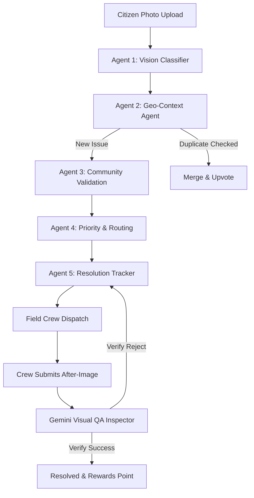

# CivSight — Autonomous & Agentic Hyperlocal Problem Solver

<div align="center">
  
</div>

> **Submission for the "Community Hero - Hyperlocal Problem Solver" Hackathon Challenge**
>
> **Live Deployed Link:** [https://civsight-877916514223.asia-southeast1.run.app/](https://civsight-877916514223.asia-southeast1.run.app/)
>
> *Powered by the Google Gemini 2.5 Flash API, Google Maps, and Firebase*

---

## 🌟 Introduction

**CivSight** is an next-generation, agentic smart city platform designed to identify, report, validate, route, and verify hyperlocal civic infrastructure issues (such as potholes, water leaks, broken streetlights, and waste accumulation). 

Instead of relying on fragmented, manual, and slow municipal reporting queues, CivSight deploys a **5-stage autonomous multi-agent pipeline** that triages citizen complaints in seconds, coordinates field dispatches, and uses Gemini to verify physical repairs via before-and-after photo analysis.

---

## 🏗️ The Multi-Agent Pipeline Architecture

At the core of CivSight is a custom 5-Stage Agentic Pipeline running autonomously:



1. **Agent 1: Vision Classifier (Gemini 2.5 Flash)**
   - Automatically analyzes the visual pixels of a reported issue.
   - Outputs structured JSON containing the category, a severity score (1–10), estimated area (sqm), action recommendation, and a citizen-friendly description.
2. **Agent 2: Geo-Context & Duplicate Detection**
   - Resolves GPS coordinates to physical Indian street addresses.
   - Scans a 200m radius of active complaints to prevent duplicate reports. If a duplicate exists, it merges the reports, upvotes the original, and awards verification points.
3. **Agent 3: Community Validation**
   - Simulates hyperlocal broadcasts to nearby citizens.
   - Moves the status from `Reported` to `Verified` once the confirmation threshold (3 confirmations) is reached.
4. **Agent 4: Priority & Routing Agent**
   - Calculates urgency priority scores using a multi-factor formula:
     $$\text{Urgency} = \text{Severity} \times \log_2(\text{Confirmations} + 1) \times \text{Area Weight}$$
   - Routes the issue to the appropriate department based on geofenced regions (e.g., PWD, PHED, JMC, or JVVNL in Jaipur; BBMP, BWSSB, BESCOM in Bengaluru).
   - Establishes strict SLA deadlines (e.g., 24 hours for Critical $\ge 8$, 72 hours for High $\ge 5$, 168 hours default).
5. **Agent 5: Resolution Tracker (Gemini 2.5 Flash QA Inspector)**
   - Monitors active SLA clocks in real-time and broadcasts warnings.
   - Powers the **Dual-Image AI Inspector** comparing "Before" vs "After" photos to verify repair quality before closing work orders, rejecting fake or duplicate submissions.

---

## 🛠️ Google Technologies Utilized

CivSight is built from the ground up to showcase Google’s cutting-edge developer stack:

*   **Google Gemini 2.5 Flash (`@google/genai` Node.js SDK)**: 
    *   **Vision Classifier**: Handles multi-modal visual triage.
    *   **Dual-Image AI Inspector**: Performs automated visual QA comparing before/after repair states.
    *   **City Analytics Dashboard**: Generates city-wide health intelligence reports and recommendations.
    *   **RAG Municipal Chatbot**: Enables natural language interaction with active queue stats, SLA compliance, and taxpayer savings.
*   **Google Maps Javascript API & Geocoder**:
    *   Renders the main GIS Monitor Grid Map with live markers color-coded by severity.
    *   Provides smooth, ambient ambient heat glow overlays to denote high-frequency issue clusters.
    *   Provides reverse geocoding of GPS coordinates to Indian addresses.
*   **Google Cloud Platform**:
    *   Designed for serverless container deployment via GCP.

---

## 🎮 Hackathon Demo Quest (Step-by-Step Walkthrough)

To make evaluation easy, a **"Civic Quest Guide"** is built directly into the sidebar. Judges can follow these steps to experience the full end-to-end loop:

### 🚶 Step 1: Report an Incident (Citizen Role)
1. In the sidebar, select **Citizen** from the Quick Role Switcher.
2. Click **Report** in the first quest step (or click the floating **+** button on the map).
3. Select one of the preset test cases (e.g., **Severe Pothole**, **Water Main Leak**).
4. Review the **Agent 1 (Vision Classifier)** live feed as it categorizes and analyzes the image.
5. Click **Confirm Classification & Proceed**.

### 🗺️ Step 2: Confirm Location & Inspect Triage
1. Drag the map marker if needed to refine the location. Note that the **Geo-Context Agent** handles reverse-geocoding.
2. Click **Submit Civic Report**. 
3. Watch the live **Multi-Agent Pipeline** execute Stage 1 to 5.
4. Once completed, click the new issue to view its details. Notice the active **SLA Countdown Timer** ticking, the assigned department, and the priority score.

### 👷 Step 3: Switch to Field Crew & Dispatch
1. In the sidebar, click **Crew** from the Quick Role Switcher (or click **Deploy** on Quest Step 3).
2. You will be redirected to the **Field Ops** workspace.
3. Select your department's route from the list. Notice that the dispatches are ordered using a **Nearest-Neighbor TSP Solver** to minimize travel distance.
4. Click **Acknowledge & Begin Work** on your reported issue. This moves the status to `In Progress`.

### 🔍 Step 4: Run Gemini QA Visual Verification
1. Under "Submit Work Proof", select an after repair image.
2. Try selecting the **"Same Image (Fails AI Inspection)"** preset first.
3. Click **Verify Resolution via Gemini AI Inspector**. Review the rejection verdict—Gemini detects that no repair was made!
4. Now, select the successful repair proof (e.g., **"Fresh Asphalt Patching"** or **"Dry Piping"**) and enter repair notes.
5. Click **Verify** again. Gemini will approve the resolution, close the ticket as `Resolved`, and award XP rewards.

### 📊 Step 5: Admin Command Center (Admin Role)
1. Switch your role to **Admin** (or click **Insights** on Quest Step 6).
2. Go to the **Dashboard** tab.
3. Click **Generate AI City Intelligence Report**. Gemini will scan your live database metrics and compile a senior-level administrative briefing, alert status, and immediate policy recommendations.
4. Open the **AI Assistant** chat drawer (bottom-right) and ask questions like:
   - *"What is the status of the water leak reported on MI Road?"*
   - *"Are there any active SLA breaches?"*
   - *"How much money has the city saved?"*

---

## 🚀 Local Run Instructions

### Prerequisites
*   [Node.js](https://nodejs.org/) (v20+ recommended)
*   Google Gemini API Key (obtained from [Google AI Studio](https://aistudio.google.com/))
*   *(Optional)* Google Maps Javascript API Key

### Setup Steps
1.  **Clone the Repository**:
    ```bash
    git clone https://github.com/PankajKumar-11/CivSight.git
    cd CivSight
    ```
2.  **Install Dependencies**:
    ```bash
    npm install
    ```
3.  **Configure Environment Variables**:
    Create a `.env` file in the root directory (based on `.env.example`):
    ```env
    GEMINI_API_KEY="YOUR_GEMINI_API_KEY_HERE"
    NEXT_PUBLIC_MAPS_API_KEY="YOUR_GOOGLE_MAPS_API_KEY_HERE"
    ```
    *Note: If no Maps API key is configured, the application automatically falls back to a custom interactive Vector Grid fallback map.*

4.  **Run Development Server**:
    ```bash
    npm run dev
    ```
    Open your browser and navigate to `http://localhost:3000`.

---

## 💎 Evaluation Alignment Checklist

| Evaluation Criterion | Weight | How CivSight Excels |
| :--- | :---: | :--- |
| **Problem Solving & Impact** | 20% | Addresses critical public health, safety, and water wastage issues with transparency, accountability, and gamified citizen XP rankings. |
| **Agentic Depth** | 20% | Goes far beyond basic API calls. Implements a sequenced **5-agent choreography** including Vision classification, geo-proximity merging, community validation, dynamic routing score calculation, and visual proof analysis. |
| **Innovation & Creativity** | 20% | Replaces slow city inspectors with a **Dual-Image Gemini QA Engine** that holds contractors and crews accountable by automatically inspecting repairs. |
| **Usage of Google Tech** | 15% | Uses the new `@google/genai` SDK with **Gemini 2.5 Flash** for multi-modal classification, verification, analytics generation, and structured JSON parsing. Leverages Google Maps live JS library. |
| **Product Experience** | 10% | Rich, premium layout using a flat, high-contrast, professional palette, complete with Framer Motion transitions and ticking SLA countdown components. |
| **Completeness & Usability** | 15% | Fully functional full-stack app featuring real-time LocalStorage synchronization, a self-guided walkthrough tour, interactive chatbot, and zero placeholders. |
