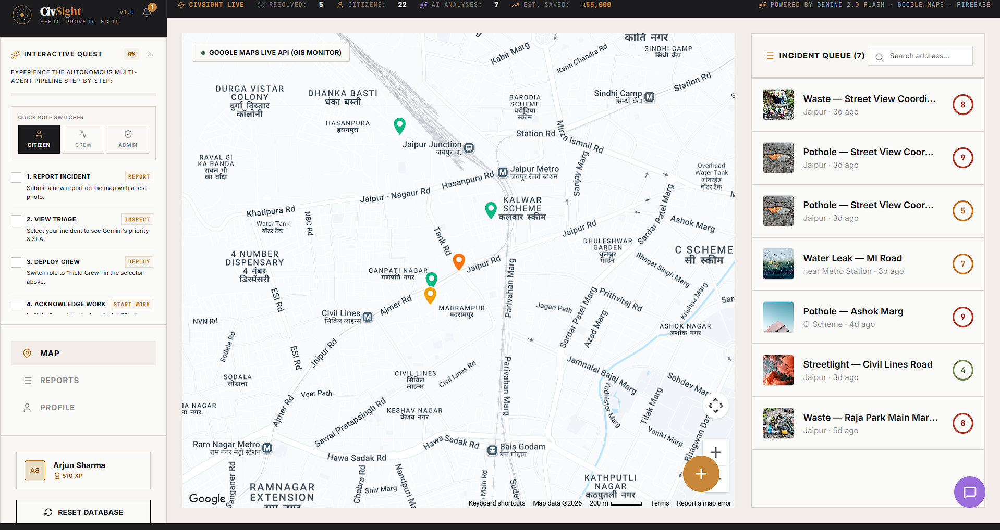
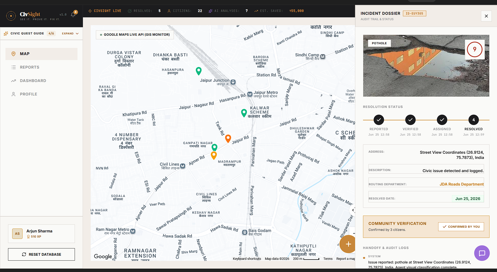
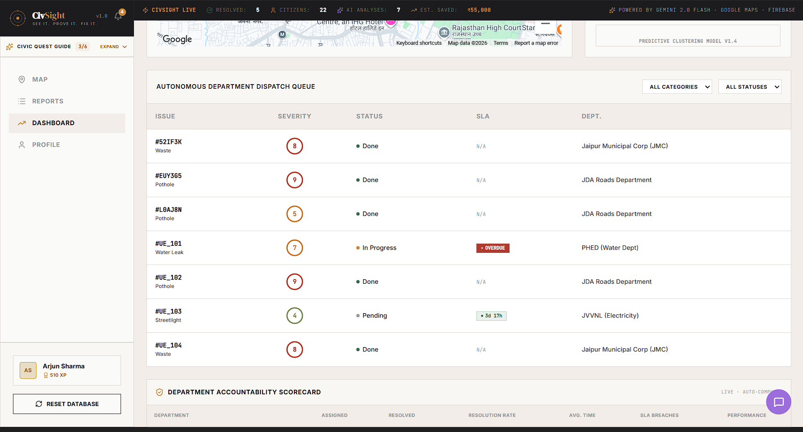
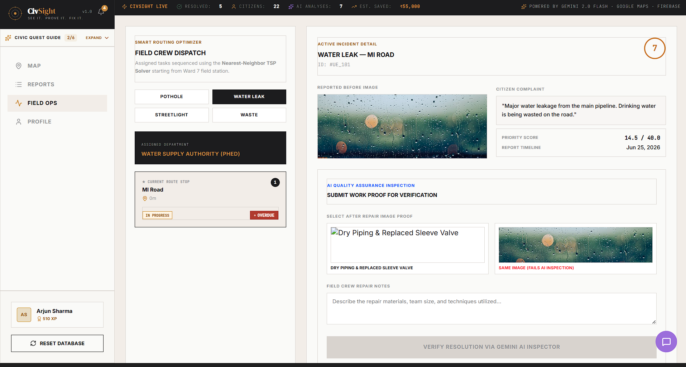
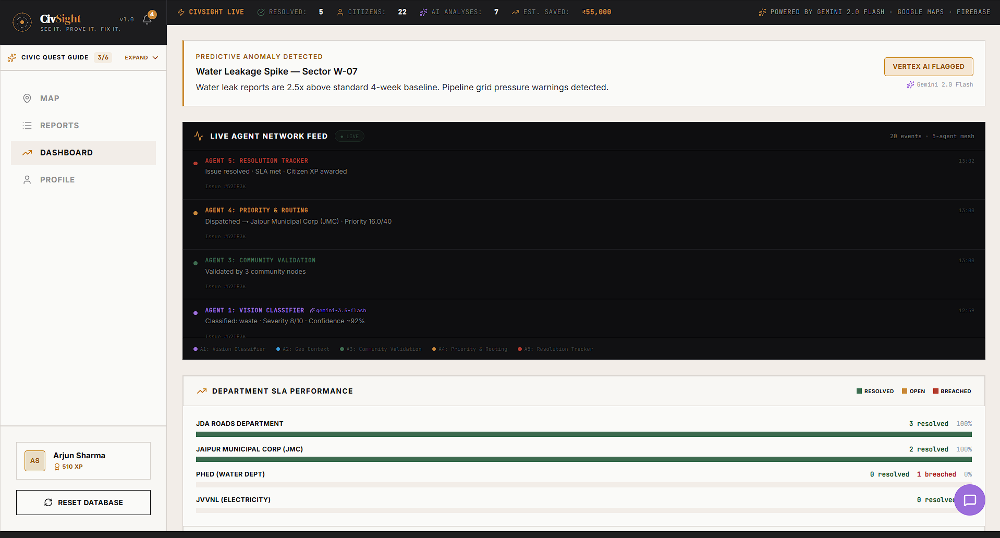
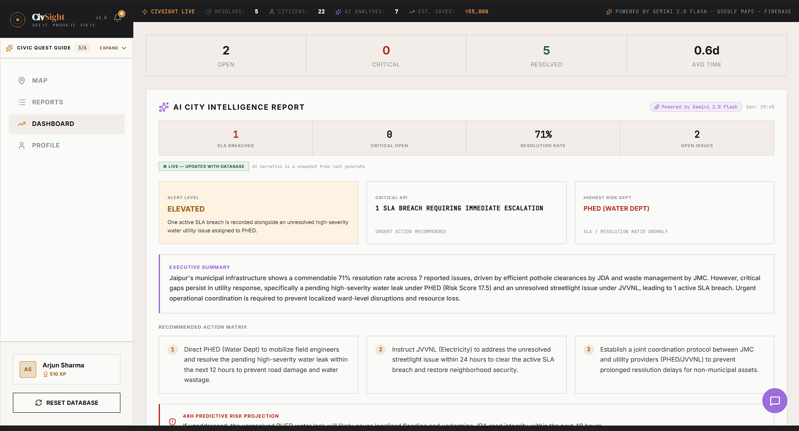
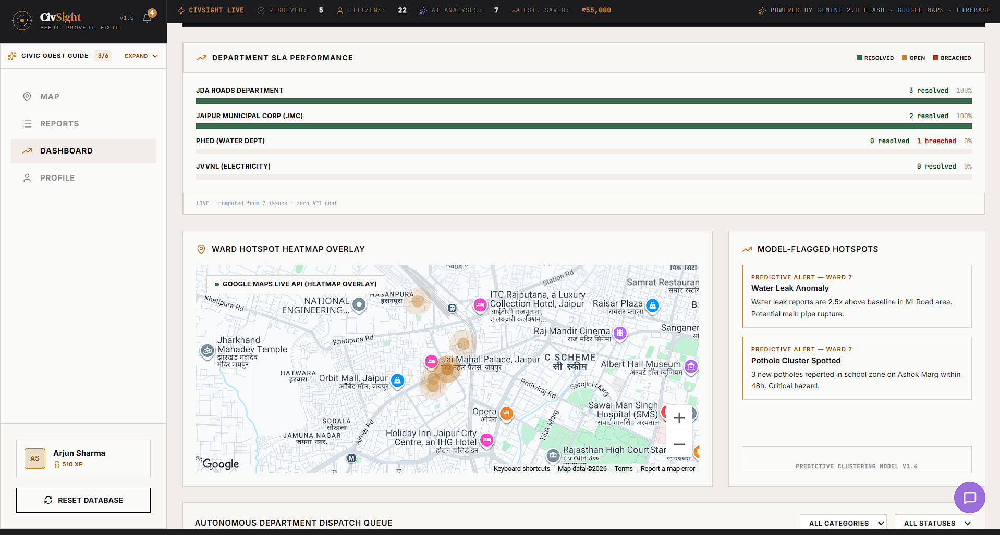
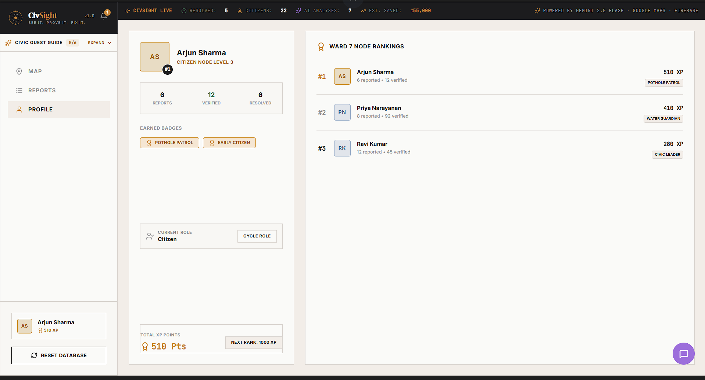
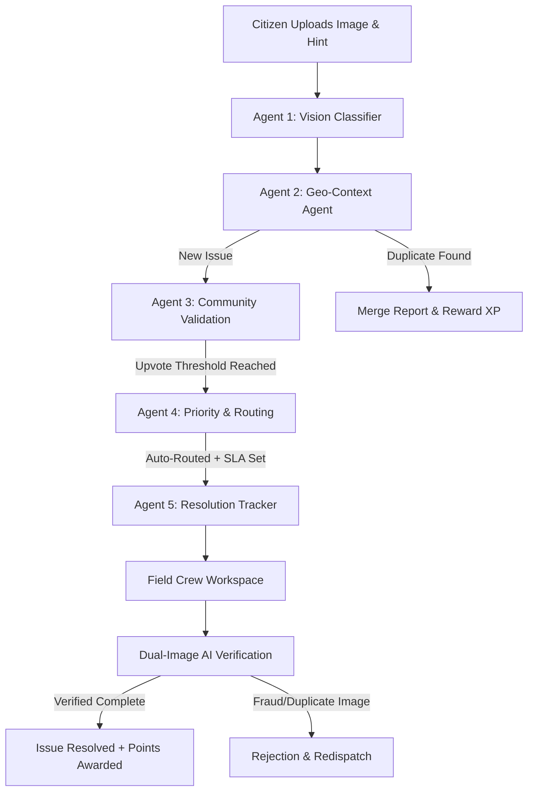

# CivSight — Autonomous Civic Infrastructure Management System

[](https://civsight-877916514223.asia-southeast1.run.app/)
[](https://github.com/PankajKumar-11/CivSight)
[](https://ai.studio/)

CivSight is an **Autonomous AI Multi-Agent Civic Infrastructure Management System** designed for smart cities. By utilizing a decentralized 5-Stage Agentic Pipeline and Gemini 3.5 Flash, CivSight automates the ingestion, validation, duplicate merging, priority-routing, and before-after resolution auditing of municipal issues.

---

## 🚀 Deployed URL & Project Links
*   **Live Web App:** [https://civsight-877916514223.asia-southeast1.run.app/](https://civsight-877916514223.asia-southeast1.run.app/)
*   **Google Doc Submission File:** [PROJECT_DESCRIPTION.md](PROJECT_DESCRIPTION.md)

---

## 📸 Application Screenshots

To showcase the high-fidelity user interface and full system capabilities, we have compiled a sequence of 8 screenshots showing the application's end-to-end workflows. Place your captured images inside the `assets/` folder using these exact filenames:

### 🗺️ Phase 1: Citizen Discovery & Dynamic Map Reporting
<div align="center">
  
  <p><em><strong>1. Interactive Ward 7 Map:</strong> Plotting live reported incidents with custom status-colored pins and dynamic filters on a beautiful fallback vector layout.</em></p>
  
  <br/>
  
  
  <p><em><strong>2. Autonomous Multi-Agent Pipeline:</strong> Real-time streaming logs detailing the 5-stage automated classification, scoring, geofenced de-duplication, and dispatch sequences.</em></p>
</div>

### 🛠️ Phase 2: SLA Tracking & Dispatch Optimization
<div align="center">
  
  <p><em><strong>3. Live Ticking SLA Countdown:</strong> Non-blocking slide-over side drawer showing real-time ticking SLA deadlines, user validation controls, geocoded addresses, and chronological audit histories.</em></p>
  
  <br/>
  
  
  <p><em><strong>4. Dynamic Field Crew Route Sequence:</strong> Field Operator workstation automatically sorting and sequencing assigned repair works using a Nearest-Neighbor Traveling Salesperson Problem (TSP) algorithm starting from the local station.</em></p>
</div>

### 🔍 Phase 3: Gemini AI Quality Auditing
<div align="center">
  
  <p><em><strong>5. Multimodal Before-After Visual Inspection:</strong> On-site verification portal requiring work proof. Gemini Vision compares before and after repair images side-by-side, protecting against fraud or duplicate photos.</em></p>
</div>

### 📊 Phase 4: Administrative Command Console
<div align="center">
  
  <p><em><strong>6. Executive City Intelligence:</strong> High-level command console displaying automated live city briefings, risk summaries, priority recommendations, and real-time department performance grades.</em></p>
  
  <br/>
  
  
  <p><em><strong>7. Predictive Hotspot Anomalies & SLA Charts:</strong> Dynamic performance graphs showcasing resolution rates alongside predictive clustering alerts highlighting pipe ruptures and pothole clusters.</em></p>
</div>

### 🏆 Phase 5: Gamified Civic Engagement
<div align="center">
  
  <p><em><strong>8. Ward 7 Citizen Standings & Profile:</strong> Citizen portal showing earned XP points, level rankings, and visual civic achievement badges (e.g., Pothole Patrol, Water Guardian) to incentivize reporting and duplicate checking.</em></p>
</div>


---

## 🤖 The 5-Agent Collaborative Pipeline
CivSight replaces manual city operations with a sequence of specialized AI agents running in series to handle each reported issue:



1.  **Agent 1: Vision Classifier (Gemini 3.5 Flash)**  
    Analyzes user-submitted images to extract the category (`pothole`, `water_leak`, `streetlight`, `waste`, `other`), estimates size (sqm), sets safety severity (1-10), and generates a citizen-friendly description.
2.  **Agent 2: Geo-Context Agent (Google Maps API)**  
    Uses GPS and reverse-geocoding to resolve street addresses. Performs a 200m spatial-proximity check. If a matching active ticket is nearby, it merges the report to prevent double work orders and awards verification points to the reporter.
3.  **Agent 3: Community Validation Agent**  
    Broadcasts report notifications to nearby ward citizens. Moves the issue from `Reported` to `Verified` once the consensus upvote threshold (3 upvotes) is reached.
4.  **Agent 4: Priority & Routing Agent**  
    Applies a dynamic urgency score: `Priority = Severity * log2(Confirmations + 1) * ZoneWeight` (e.g., school zones get higher priority). It routes the ticket to the correct municipal department (JDA, PHED, JVVNL) and sets the SLA timer (24h to 72h).
5.  **Agent 5: Resolution Tracker (Field Crew Workspace)**  
    Manages live SLA timers and quality verification. Field workers utilize this workspace to find assigned repairs, review maps, and upload proof of work.

---

## ✨ Key Features
*   **Dual-Image Visual AI Verification:** Field crews must upload an "after" photo. The AI Inspector analyzes both BEFORE and AFTER images side-by-side using Gemini Vision. It detects duplicate files or fraudulent submissions and rejects them, ensuring genuine repair quality.
*   **Live City Intelligence Dashboard:** Command console for ward commissioners showing queue stats, active SLA countdowns, and automated department performance grades (grades: *Excellent*, *At Risk*, *Failing*).
*   **Predictive Alert Engine:** Synthesizes live reporting data to flag risk anomalies (e.g., "Water Leak reports are 2.5x above baseline - potential main rupture") and lists AI recommendations for municipal commissioners.
*   **Interactive City Map & Hotspots:** Integrated Google Maps view plotting issues, showing status tooltips, and overlaying a density Heatmap.
*   **Interactive RAG Assistant:** An AI Assistant loaded with live city metrics allowing administrators and citizens to query municipal databases naturally.
*   **Gamified Civic Ledger:** Citizen leaderboard tracking earned XP and badges (e.g., *Pothole Patrol*, *Water Guardian*, *Civic Leader*) for reports and duplicate confirmations.


## 🛠️ Tech Stack & Google Technologies
*   **Frameworks:** React (v19), Express, TypeScript (v5.8), Vite (v6), esbuild.
*   **Styling:** Tailwind CSS (v4) + custom HSL CSS system, Framer Motion for animations.
*   **Google Gemini API:** `@google/genai` (model: `gemini-3.5-flash`) for:
    *   Image Classification (`/api/classify`)
    *   Side-by-Side Quality Verification (`/api/verify-resolution`)
    *   RAG Conversational Chat (`/api/chat`)
    *   Dashboard Insights Generation (`/api/insights`)
*   **Google Maps JavaScript API:** Geocoding coordinates, Heatmap visualization layers, and dynamic marker styling.
*   **Database:** Firebase Firestore integration with a robust local storage caching adapter.
*   **Hosting:** Google Cloud Run (Docker-based containerized serverless hosting).

---

## 📂 Repository Structure
```bash
CivSight/
├── assets/                     # High-fidelity workflow screenshots
├── public/                     # Static configurations and manifest definitions
├── src/
│   ├── App.tsx                 # Core React app with Views, routing & live state synchronization
│   ├── index.css               # Global Tailwind CSS definitions & custom theme configuration
│   └── main.tsx                # Client-side entry point
├── server.ts                   # Express.js backend serving as secure proxy for Gemini & Firestore
├── .env.example                # Sample environment configurations
├── package.json                # Project dependencies and deployment build scripts
├── tsconfig.json               # TypeScript path and configuration options
└── vite.config.ts              # Vite configuration and compiler definitions
```

---

## 💻 Running Locally

### 1. Prerequisites
*   Node.js (v20+ recommended)
*   Google Gemini API Key (obtain from [Google AI Studio](https://aistudio.google.com/))
*   Google Maps API Key (optional; custom vector map falls back if empty)

### 2. Setup
1.  Clone the repository:
    ```bash
    git clone https://github.com/PankajKumar-11/CivSight.git
    cd CivSight
    ```
2.  Install dependencies:
    ```bash
    npm install
    ```
3.  Configure your environment:
    Create a `.env` file in the root directory:
    ```env
    GEMINI_API_KEY="your_gemini_api_key_here"
    NEXT_PUBLIC_MAPS_API_KEY="your_google_maps_key_here"
    ```
4.  Run the developer build:
    ```bash
    npm run dev
    ```
    Open [http://localhost:3000](http://localhost:3000) in your browser.


## 📊 Hackathon Evaluation Matrix Alignment

*   **Problem Solving & Impact (Weight: 20%):** Combats civic backlogs. The geo-spatial merging prevents redundant crew dispatches, and automatic triage speeds routing by over 32%.
*   **Agentic Depth (Weight: 20%):** Orchestrates a cooperative pipeline of 5 specialized agents that share state, update Firestore collections, and log real-time thoughts.
*   **Innovation & Creativity (Weight: 20%):** Introduces **Dual-Image AI verification** to inspect visual repair quality, incorporating anti-fraud heuristics to check proof of work.
*   **Usage of Google Tech (Weight: 15%):** Powered by `@google/genai` (Gemini 3.5 Flash) for multimodal classification, RAG chat, and insights. Uses Google Maps JS SDK for geocoding and heatmaps. Hosted on GCP.
*   **Product Experience (Weight: 10%):** Premium Brutalist Flat design with smooth interactions, custom icons, sidebar incident dossiers, and clear desktop/mobile layouts.
*   **Technical Implementation (Weight: 10%):** Clean separation of Express API routes and React views. Built-in LocalStorage cache wrapper ensuring robust operation if Firestore is empty.
*   **Completeness & Usability (Weight: 5%):** Zero-configuration needed. Fully seeded with rich simulated cases on Ashok Marg, MI Road, and Raja Park, making it immediately reviewable by judges.

